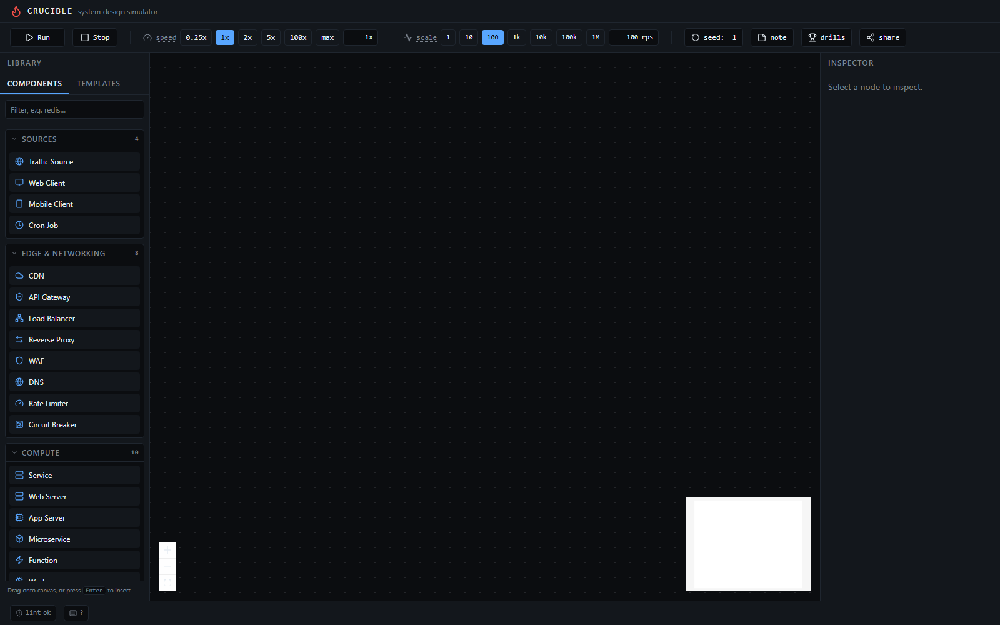
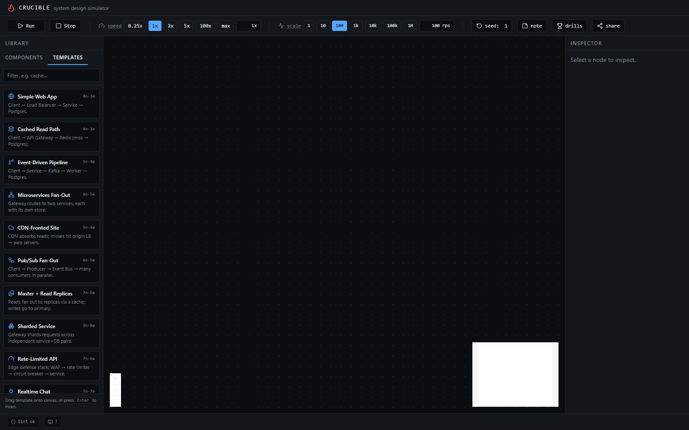
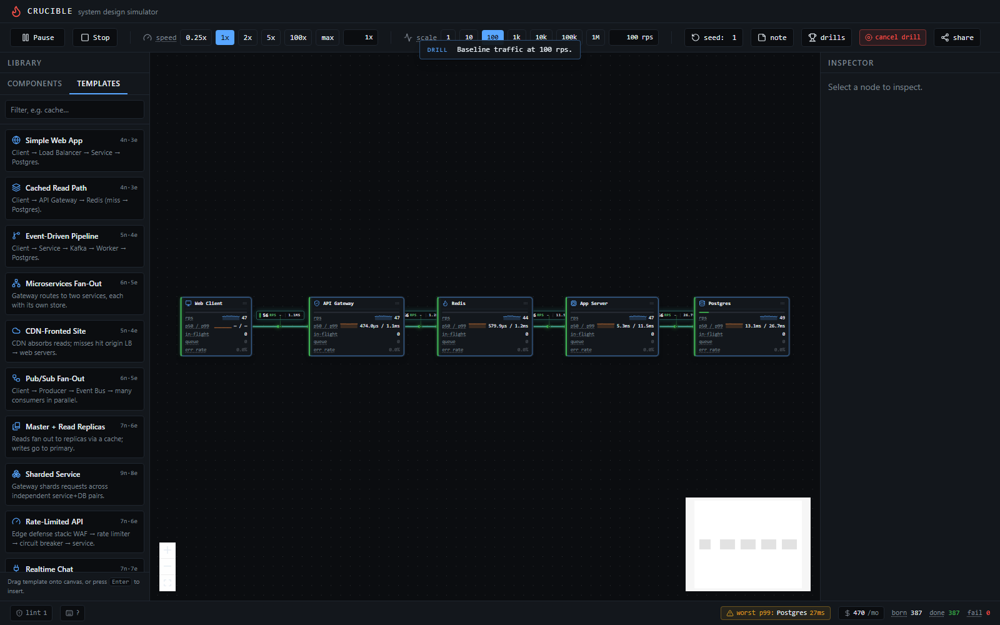
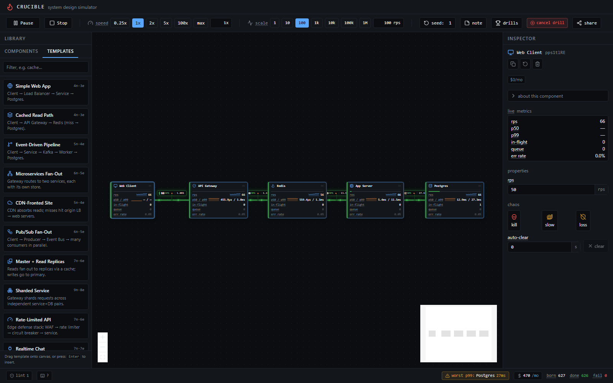
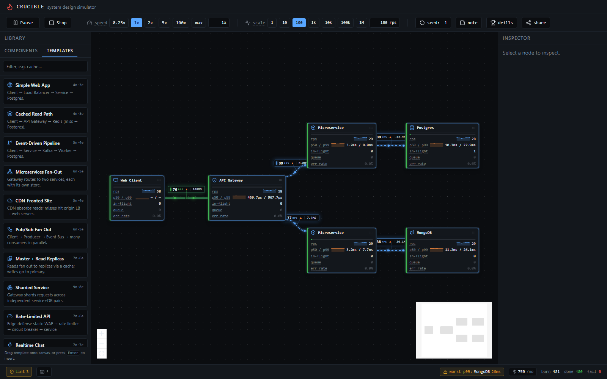

# Crucible

Browser-based system design simulator. Drag components onto a canvas, connect them, drive traffic, inject failures, watch real-time metrics.

Not a diagramming tool. Architectures actually **run**.

---

## What it does

- **Drag & drop components** — 23-kind catalog: clients, CDN, WAF, DNS, LB, services, functions, workers, caches (Redis / Memcached), databases (Postgres / MySQL / Mongo / DynamoDB / Cassandra / Elasticsearch), queues (Kafka / RabbitMQ / SQS), event bus
- **Wire them up** — easy-connect floating edges, drop-to-create, strict port rules
- **Drive traffic** — global RPS scrubber, 1 → 1,000,000 requests per second, decade chips
- **Speed up time** — 0.25x / 1x / 2x / 5x / 100x / max
- **Inject chaos** — kill nodes, slow them down, drop packets; live fault flash on the canvas
- **Watch metrics live** — per-node throughput, p50/p99 latency, in-flight, queue depth, error rate, sparklines, capacity gauges, edge rps pills
- **Topology lint** — 9 rules over the spec, anti-pattern chips per node, worst-p99 diagnosis pill
- **Cost + SLO chips** — per-node monthly $ + p99 budget, total $/mo in the toolbar
- **Templates + scenarios** — 13 starter architectures, 6 scripted drills (cache stampede, DB failover, thundering herd, …)
- **Save / share** — export / import canvas as JSON, sticky-note annotations, keyboard shortcuts overlay

Built for system design interview prep, architecture validation, and teaching distributed systems concepts.

---

## Stack

| Layer | Choice | Why |
|-------|--------|-----|
| Frontend | SvelteKit 2 + Svelte 5 runes | Fine-grained reactivity, small bundle |
| Canvas | `@xyflow/svelte` | Node-graph primitives done right |
| Icons | `@lucide/svelte` | Tree-shaken per icon |
| Styling | Tailwind | Dark theme out of box |
| Simulation | Go → TinyGo → WASM | Same code testable with `go test`, ships ~200KB |
| Sim host | Web Worker | Keeps main thread at 60fps regardless of sim load |
| Storage | JSON export/import today → Supabase Postgres later | Zero infra to start |
| Deploy | Vercel (static) | Free, fast, no Node runtime needed |
| Package mgr | bun | Fast install, fast scripts |

No server. Sim runs in your browser. Scales to as many users as Vercel CDN serves.

---

## Architecture

### Hybrid scheduler

Two clocks:

- **Sim clock** — event-driven. Jumps to the next event time via a min-heap (`engine/heap.go`). No idle ticks.
- **Render clock** — fixed cadence in the Worker. Snapshots metrics every ~33ms, posts to the main thread.

`Sim.Step(budgetSimNs, maxEvents)` advances events until the sim clock exceeds `now + budgetSimNs`, or `maxEvents` are processed, whichever first. Worker passes a **wall-time budget** (12ms) per tick; the Go side multiplies by `speed` to get the sim budget. `max` speed = giant sim budget, wall cap stops it.

Two ceilings, two failure modes covered: runaway producer (event cap), runaway sim time (wall cap).

### Determinism

PCG32 RNG seeded once. Min-heap with `(time, seq)` ordering. Integer nanosecond clock. Result: same seed + same topology = identical run, byte-for-byte. Share-replay falls out of the design for free.

### Node model

Every node implements:

```go
type Node interface {
    ID() string
    Kind() string
    OnRequest(*Sim, *Request)              // a request arrived
    OnEvent(*Sim, Event)                   // ServiceDone, Tick, fault toggle
    SetFaulted(FaultKind, bool)            // chaos hook
    Snapshot() NodeMetrics                 // cheap, called every render
}
```

Engine kinds in `sim/nodes/` (the simulator has 6 archetypes; the frontend catalog maps 23 UI kinds onto them via `engineKind`):

- **Source** — Poisson arrivals at configurable RPS (`ExpNs`); orphan sources fail requests instead of marking them complete
- **LoadBalancer** — round-robin / least-in-flight / random; filters faulted backends; round-robin fans out across multiple downstreams
- **Service** — capacity, queue limit, log-normal service time; propagates downstream failures back up the err_rate chain
- **Cache** — hit/miss; miss forwards downstream
- **Database** — slow service preset
- **Queue** — buffer + drain rate

Nodes and edges can be hot-added while the sim is running.

### Metrics

- Latency: 512-sample ring buffer per node, percentile via insertion-sort copy
- Throughput: 10 buckets × 100ms sliding window
- Faults: kill / slow / packet-loss flags propagate on the next `OnRequest`

---

## Layout

```
crucible/
├── README.md
├── Makefile                  # tinygo build → static/sim.wasm
├── .gitignore
│
├── sim/                      # Go simulation engine
│   ├── go.mod
│   ├── main.go               # WASM bridge (syscall/js) — exports `crucible` global
│   ├── engine/               # Sim, heap, event, RNG, node interface, request
│   ├── nodes/                # source, service, loadbalancer, cache, database, queue
│   ├── chaos/                # fault injection
│   ├── metrics/              # latency ring, throughput window
│   └── topology/             # JSON spec ↔ Sim builder
│
└── apps/web/                 # SvelteKit + Svelte 5
    ├── package.json
    ├── svelte.config.js      # adapter-static
    ├── vite.config.ts        # COOP/COEP headers, worker ES format
    ├── tailwind.config.ts
    ├── src/
    │   ├── app.html
    │   ├── app.css
    │   ├── lib/
    │   │   ├── types/        # topology spec, node catalog (icons)
    │   │   ├── stores/       # design (canvas state), sim (worker bridge) — runes
    │   │   ├── sim/          # sim.worker.ts — Worker + WASM loader
    │   │   ├── components/   # Palette, ControlBar, Inspector, nodes/CrucibleNode
    │   │   └── canvas/       # Canvas.svelte — Svelte Flow wrapper
    │   └── routes/           # SPA, prerendered, ssr=false
    └── static/               # sim.wasm + wasm_exec.js drop here (build artifacts)
```

---

## Run locally

Prereqs: bun, Go 1.22+, TinyGo (recommended; standard Go works too).

```bash
# 1. install web deps
cd apps/web
bun install

# 2. build the sim
cd ..
make sim                                                    # tinygo build
cp $(tinygo env TINYGOROOT)/targets/wasm_exec.js apps/web/static/

# 3. dev server
cd apps/web
bun run dev
```

Open http://localhost:5173. Drag a Source → Service → Database, click Run.

### Build targets

```bash
make sim          # TinyGo build (~200KB, recommended)
make sim-go       # standard Go build (~2MB, full stdlib)
make clean        # remove sim.wasm
```

### Check commands

```bash
cd apps/web
bun run typecheck
bun run lint

cd ../sim
go test ./...
go vet ./...
```

---

## Topology JSON contract

The frontend serializes the Svelte Flow graph into:

```json
{
  "seed": 42,
  "nodes": [
    { "id": "src1", "kind": "source", "props": { "rps": 1000 } },
    { "id": "lb1",  "kind": "loadbalancer", "props": { "strategy": "leastInFlight" } },
    { "id": "svc1", "kind": "service", "props": { "capacity": 50, "meanNs": 2000000 } },
    { "id": "db1",  "kind": "database", "props": {} }
  ],
  "edges": [
    { "src": "src1", "dst": "lb1" },
    { "src": "lb1",  "dst": "svc1" },
    { "src": "svc1", "dst": "db1" }
  ]
}
```

Same spec parsed by `sim/topology/loader.go` to build the `Sim`. Serializable, diffable, replay-able.

---

## WASM bridge contract

Go exports a global `crucible` with:

| Function | Args | Returns |
|----------|------|---------|
| `load(specJson)` | string | `{ ok }` or `{ error }` |
| `step(wallBudgetMs)` | number | events processed |
| `snapshot()` | — | JSON string `{ now, born, completed, failed, nodes[] }` |
| `setSpeed(v)` | number | new speed |
| `setRPS(nodeId, rps)` | string, number | bool |
| `injectFault(nodeId, kind, on)` | string, FaultKind, bool | bool |
| `reset()` | — | bool |

Type contract in `apps/web/src/lib/sim/wasm_exec.d.ts`.

---

## Screenshots

Empty canvas — palette grouped by category (sources / edge / compute / storage / async / observability).



Templates tab — 13 starter architectures, each labelled by node + edge count.



Mid-drill — `Baseline traffic at 100 rps` running through Client → Gateway → Redis → App → Postgres. Live rps + p50/p99 per node, edge pills, worst-p99 chip, cost meter, born/done/fail counters in the StatusBar.



Inspector — selected node shows engine props, live metrics, chaos buttons, anti-pattern chips.



Microservices fan-out template, dragged in and running — gateway routes to two independent service+store pairs in parallel.



Regenerate via `bun scripts/screenshots.ts` (dev server must be running on `:5173`).

---

## Design decisions worth knowing

- **No SSR.** This is a single-page app. `ssr = false` in `+layout.ts`, `adapter-static` ships a CDN-only bundle.
- **COOP/COEP headers.** Set in `vite.config.ts` so `SharedArrayBuffer` is available later if we move to multi-threaded WASM.
- **TinyGo over standard Go.** 10x smaller bundle. Reflect-free code paths only. If you hit a missing stdlib feature, `make sim-go` falls back.
- **Insertion sort in `LatencyRing`.** Yes, really. 512 samples, mostly sorted between calls, tiny code, fits in instruction cache. `sort.Slice` is bigger in TinyGo output than this loop.
- **Snapshot at 30Hz, sim at unbounded Hz.** Render cadence and sim cadence are separate concerns. The animation overlay can run at 60Hz reading the same snapshot buffer.
- **Logarithmic RPS slider.** Linear is useless across 6 orders of magnitude. Map `slider [0,100] → 10^[0,6] rps`.

---

## License

TBD.
